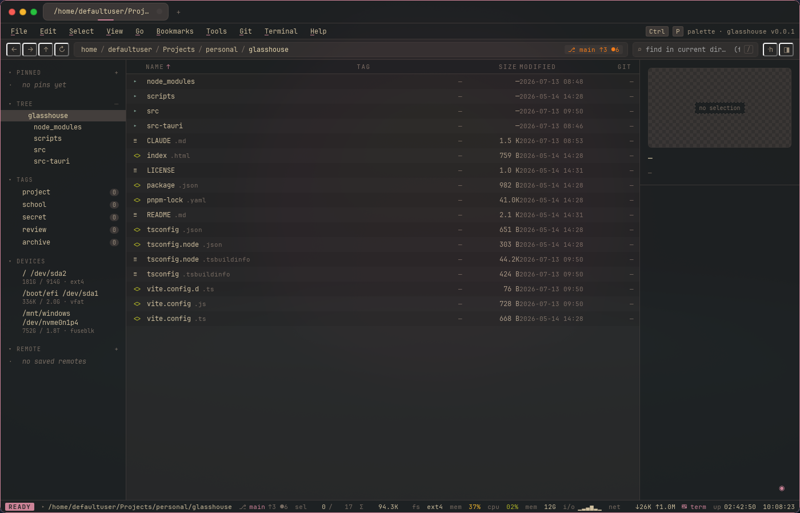

# glasshouse

[](https://github.com/Johnson-Anthony/glasshouse/actions/workflows/ci.yml)

> A riced-out file manager for Windows and Linux — tabbed browsing, multi-tab embedded terminal, git-aware sidebar, themed dialogs.

**[Project page](https://johnson-anthony.github.io/glasshouse/)**



## What it is

Glasshouse is a desktop file manager built with Tauri 2 (Rust backend) and React 18 + TypeScript on the frontend. It's Windows-first — focused on the things stock Explorer doesn't do well: a real embedded terminal, multi-tab navigation, archive handling, and a sidebar that knows what's a git repo and what isn't — and it also runs on Linux (mounts, trash, net rates, and terminal spawning all have native backends).

## Features

- **Multi-tab browsing** with private/incognito tabs
- **Embedded terminal drawer** (xterm.js) — multiple concurrent shell tabs pinned to the current directory, with a profile picker (shells, WSL distros, saved ssh remotes)
- **Git-aware sidebar** — repos are detected via `libgit2`; status decorations on tracked paths
- **Inline archive handling** — extract `.zip`, `.tar.gz`, `.tar.zst`, `.7z` without external tools
- **File tagging** and bookmarks
- **Fuzzy search** across the active directory
- **Themed dialogs and context menus** — consistent styling instead of native OS chrome
- **Inspector + status bar** — file metadata and live operation feedback

## Stack

- **Frontend:** React 18, TypeScript, Vite, [xterm.js](https://xtermjs.org)
- **Backend:** Rust, Tauri 2, [`git2`](https://crates.io/crates/git2), [`notify`](https://crates.io/crates/notify), [`sysinfo`](https://crates.io/crates/sysinfo)
- **Tauri plugins:** `fs`, `dialog`, `shell`, `os`, `opener`
- **Package manager:** pnpm 9

## Run it

Requires Rust toolchain, Node 20+, and pnpm. Platform extras:

- **Windows:** the [Tauri prerequisites](https://v2.tauri.app/start/prerequisites/) (WebView2, Visual Studio Build Tools).
- **Linux:** WebKitGTK and friends — `webkit2gtk-4.1` (Arch) or `libwebkit2gtk-4.1-dev libgtk-3-dev librsvg2-dev patchelf` (Debian/Ubuntu).

```bash
pnpm install
pnpm tauri:dev      # run the desktop app in dev mode
pnpm tauri:build    # produce a release bundle
```

## Status

Active development. Core file operations, tabs, terminal, archive handling, and git decorations work. Polish passes ongoing on dialog theming, drag-and-drop, and remote-target browsing.

## License

MIT — see [LICENSE](LICENSE).
